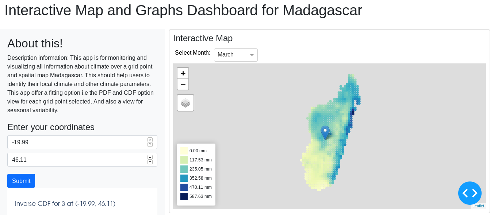
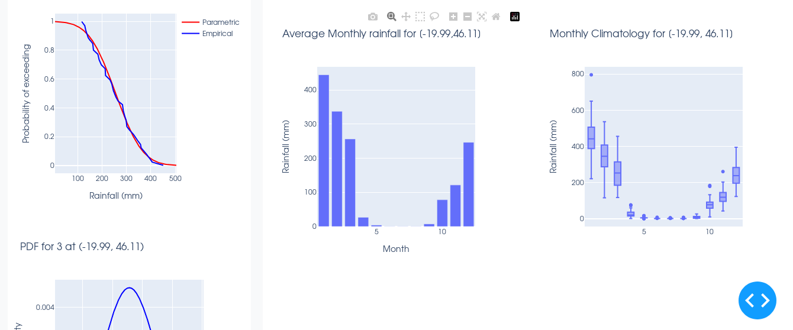

# README #

This is a dashboard for visualizing spatial and grid-point climatology over Madagascar. It is based on the structure of the Python Maproom project.

Special thanks to the tutorial on GitHub made by the IRI.

### What is this repository for? ###

* Quick summary
* Version 1
* You can see somthing like this: 

* And then: 

### How do I run this? ###
* Clone this repository
* run by CONFIG=config.yaml python app.py